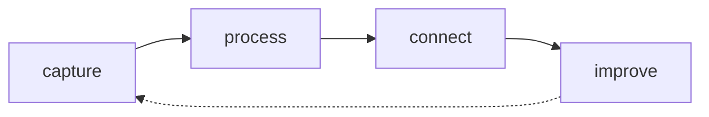

# Gray vault

Notes on everything I have learned and have not been too lazy to write down.

This is my personal knowledge vault: a collection of notes about college, software engineering, math, statistics, books, courses, projects, random discoveries and ideas that probably started as "I should write this down before I forget it."

The main idea is simple: I want control over my notes.

That is why this vault is based on plain text files, mostly Markdown. Markdown is portable, easy to read, easy to version control and can be opened with almost anything. No database hostage situation. No mystery binary format. Just files.

I started by using VS Code to manage my notes, but later gave [Obsidian](https://obsidian.md) a try. Obsidian is now my main tool for note management because it is focused on linked notes, navigation and knowledge organization. I know VS Code can be turned into something similar with extensions, but that would require too many plugins and probably writing some myself.

All Obsidian-related configuration lives in `.obsidian`.

## Organization philosophy

This vault separates two things:

1. **Where I learned something**.

2. **What the thing is actually about**.

A class note preserves the context where I learned something.

A concept note preserves the reusable knowledge.

For example, a topic may first appear in a college course, but if it becomes useful long-term, it should eventually become a permanent note in one of the knowledge areas.

The rule is **course notes preserve context. Concept notes preserve knowledge**. Instead of duplicating the same explanation in many places, related notes should be connected with links.

Example:

```md
## Related notes

- [[dynamic_programming]].

- [[knapsack]].

- [[greedy_algorithm]]
```

## Structure

The vault is organized like this:

```text
.
├── 00-inbox/
├── 01-areas/
├── 02-resources/
├── 99-archive/
├── templates/
├── journal.md
└── README.md
```

## `00-inbox/`

Temporary notes.

This is where raw, messy, unfinished, or uncategorized notes start.

The inbox is not meant to be permanent. It is a buffer.

A note in `00-inbox/` should eventually become one of these:

```text
02-areas/
03-resources/
99-archive/
```

Or it should be deleted.

The rule is:

> Capture quickly, organize later, but do organize later.

## `01-areas/`

Long-term knowledge.

This is the actual knowledge base of the vault.

Notes in this directory are organized by topic instead of by source, semester, book, course, or temporary context.

Example:

```text
01-areas/
├── math/
├── statistics/
├── systems_engineering/
├── english/
└── career/
```

If a note explains something I expect to reuse, improve, or connect with other ideas, it belongs here.

Examples:

```text
01-areas/systems_engineering/algorithms/dynamic_programming.md
01-areas/systems_engineering/problems/knapsack.md
01-areas/math/number_theory/euclidean_algorithm.md
01-areas/systems_engineering/web/REST_API.md
```

## `02-resources/`

Notes based on external sources.

This includes books, courses, videos, documentation, articles and other learning material.

Example:

```text
02-resources/
├── books/
└── courses/
```

Resources are sources of knowledge, but they are not always the final home for knowledge.

If something from a book or course becomes reusable, it should be extracted into `01-areas/` and linked back to the original resource note when useful.

The rule is:

> Resources are where ideas come from. Areas are where ideas live.

## `99-archive/`

Old or inactive material.

This directory contains notes that are no longer active but are still worth keeping.

The archive is not trash. It is cold storage.

A note belongs here when it is no longer part of the main working system but may still be useful later.

## `templates/`

Reusable note templates.

Templates help keep note structure consistent without turning the vault into paperwork hell.

Example:

```text
templates/
└── default.md
```

## Index notes

Important directories should have an `index.md`.

An index is not just a table of contents. It is a map.

A good index may include:

```md
# Systems Engineering

## Main topics

- [[algorithms/dynamic_programming]].

- [[problems/knapsack]].

- [[web/REST_API]].

- [[programming_languages/Python/module]].

## Useful references

- [[git/commit_message_conventions]].

- [[linux/useful_commands_for_creating_scripts]].

- [[latex/cheatsheet]].

## Notes that need work

- [[some_unfinished_note]].
```

The purpose of an index is to make navigation easier without depending only on search.

## Naming conventions

File and folder names should be terminal-friendly.

Preferred style:

```text
lowercase_snake_case.md
```

Examples:

```text
dynamic_programming.md
matrix_chain_multiplication.md
commit_message_conventions.md
```

For ordered notes, use numeric prefixes:

```text
01-introduction.md
02-basic_concepts.md
03-examples.md
```

Avoid:

```text
spaces in file names.md
VeryInconsistentCapitalization.md
super-long-file-names-that-try-to-say-everything.md
```

The goal is to keep files easy to search, rename, script and manipulate from the terminal.

## Assets

Images and other assets should live close to the notes that use them.

Preferred pattern:

```text
topic/
├── assets/
│   └── image.svg
├── 01-introduction.md
└── 02-examples.md
```

This keeps notes easier to move, review and maintain.

A global assets directory is avoided unless the asset is truly shared across many unrelated notes.

## Workflow

The basic workflow is:



## Capture

New notes can start messy.

They usually begin in `00-inbox/`.

A rough note is better than a forgotten idea.

## Process

When a note becomes useful, it should move to the right place.

Examples:

```text
00-inbox/unit_test.md
```

Can become:

```text
02-areas/systems_engineering/testing/unit_testing.md
```

## Connect

Related notes should link to each other.

Example:

```md
## Related

- [[gitflow]]

- [[commit_message_conventions]]

- [[stash_changes]]
```

Links are better than copying the same explanation everywhere.

## Improve

Notes are allowed to be incomplete.

The goal is not to make every note perfect immediately. The goal is to make knowledge easier to capture, revisit, connect and improve.

A useful note can start as:

```md
# Topic

I do not fully understand this yet, but here is what I know.
```

Then it can improve over time.

## Maintenance commands

Because this vault is just files, it can be inspected with normal Unix tools.

Count Markdown notes:

```bash
find . -name '*.md' | wc -l
```

Find files with spaces:

```bash
find . -name '* *'
```

Find empty directories:

```bash
find . -type d -empty
```

Find duplicate file names:

```bash
find . -type f -printf '%f\n' | sort | uniq -d
```

Find old Markdown notes:

```bash
find . -name '*.md' -mtime +180
```

Find possible typo names:

```bash
find . -iname '*definiton*' -o -iname '*fundametals*' -o -iname '*languajes*'
```

The vault should be manageable from the terminal, not only from Obsidian.

## General rules

These are the rules of the vault:

1. New messy notes go to `00-inbox/`.

2. Long-term reusable knowledge goes in `01-areas/`.

3. Books and courses live in `02-resources/`.

4. Old inactive material goes to `99-archive/`.

5. Important folders should have an `index.md`.

6. Assets should live close to the notes that use them.

7. Links are better than duplicated explanations.

8. File names should be terminal-friendly.

9. The system should stay simple enough to maintain with plain text tools.

## Tooling

This vault uses my own [`style_config`](https://github.com/braz9LKDI/style_config) kit to keep notes consistent, specifically its `markdown/` stack:

- Prettier handles prose wrapping, code block formatting and table alignment.

- markdownlint catches structural issues like inconsistent list indentation, broken headings or stray HTML.

- EditorConfig sets editor-level basics: indent style, line endings and final newline.

Every config in the root of this vault (`.prettierrc.json`, `.markdownlint.jsonc`, `.editorconfig`, `.vscode/`) is a direct copy from that stack. The same setup can be adopted in any notes or documentation repository by copying the `markdown/` folder and following its README.

## Contributing

Pull requests are welcome, as long as they follow the [style guidelines](style_guide.md).

Useful contributions include:

- fixing typos.

- improving explanations.

- fixing broken links.

- correcting wrong information.

- suggesting better organization.

- pointing out questionable bullshit I wrote while half asleep.

This is a personal vault, so not everything is meant to be polished or universally useful, but improvements are appreciated.
