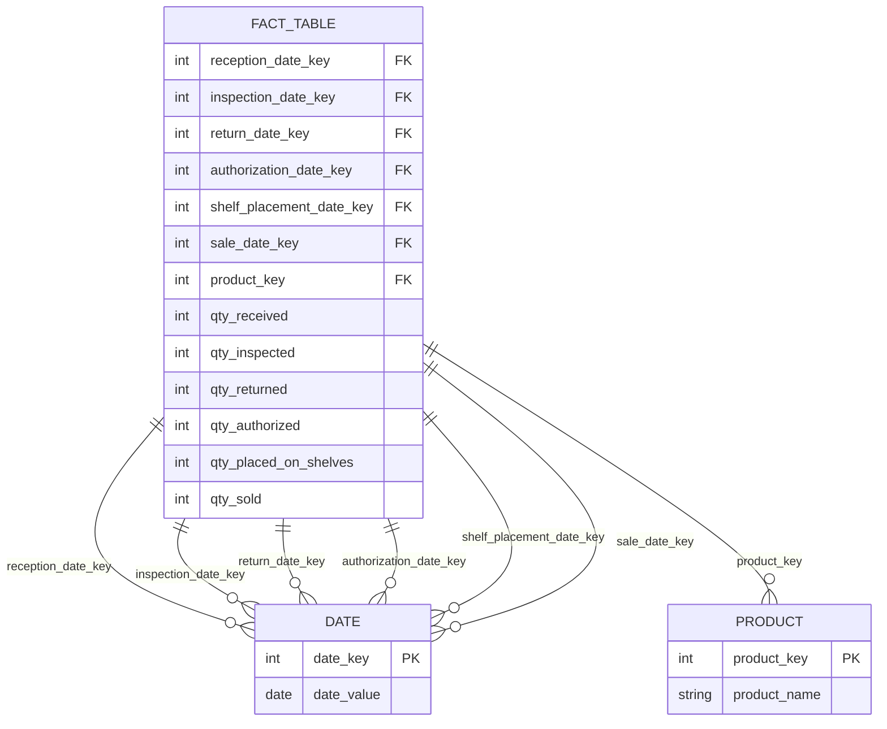

# Types of facts

## Modelos de inventario

La optimización en las tiendas puede tener un impacto importante sobre la rentabilidad de una cadena de almacenes.

Es normal que no todos los productos que ofrecen un almacén se vendan en un día, pero esto de igual forma supone que se inserten $p$ registros en la tabla de hechos, donde $p$ corresponde al número de productos que maneje el almacén. Para evitar que esta situación se vuelva inmanejable, es común tener dos tablas de hechos (en este contexto, una podría ser diaria y la otra semanal).

### Hechos semi-aditivos

Los hechos de un inventario no son aditivos con todas las dimensiones.

> En especial con el tiempo.

En estos casos la medida más común es el **promedio**.

### Periodic snapshot fact table

Se usa para medir los hechos que corresponden a un cierto periodo de tiempo. Todas las entidades de información aparecen en la tabla de hechos, así no haya actividad con estas entidades.

> Se tiene que seguir llevando registro de estas entidades.

### Accumulating snapshot fact table

Se usa para modelar las diferentes partes de un proceso de negocio.

En el contexto de un modelo de inventario, usaríamos este tipo de tabla para proporcionar la actualización del estado de un producto a medida que avanza a través de diferentes fases del proceso.

Cada registro en la tabla de hechos representa una instancia del proceso completo.

> Esta tabla es una variación de periodic snapshot.

## Tabla de hechos sin hechos

No contiene hechos medibles, es una intersección de todas sus dimensiones.

> Se usa generalmente para medir la asistencia a eventos.

## Bus architecture

Mediante esta arquitectura, diferentes **data marts** se pueden implementar por diferentes equipos de trabajo. Para modelarla podemos usar una matriz que tenga como filas los **business processes** y como columnas las **dimensions**.

## Dimensiones conformadas

Tiene llaves, atributos, nombres de columnas y valores de atributos consistentes.

Estas dimensiones significan exactamente lo mismo con cada tabla de hechos a la que se unen.
