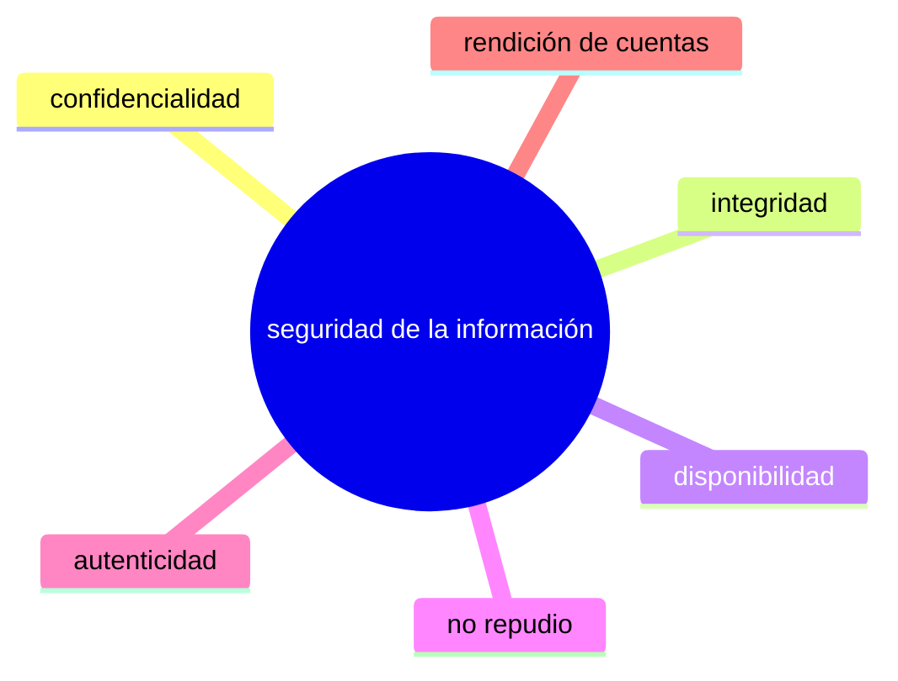
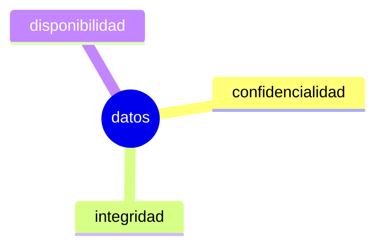

# Introduction

La ciberseguridad es el conjunto de prácticas, tecnologías y estrategias destinadas a proteger sistemas informáticos, redes, dispositivos y datos contra amenazas digitales. Su objetivo principal es evitar el acceso no autorizado, el daño, la alteración o el robo de información.

## Amenazas comunes para la ciberseguridad

### Malware

Abreviatura de "software malicioso", es cualquier código de software o programa informático escrito intencionalmente para dañar un sistema informático o a sus usuarios.

#### Ransomware

Es un tipo de malware que cifra los datos o el dispositivo de una víctima y amenaza con mantenerlos cifrados, a menos que la víctima pague un rescate al atacante.

### Phishing

Son mensajes de correo electrónico, texto o voz que engañan a los usuarios para que descarguen malware, compartan información confidencial o envíen fondos a las personas equivocadas.

## Principios de la ciberseguridad

### Confidencialidad

Se refiere a que la información solo debe ser accesible a las personas autorizadas. Esto implica establecer controles de acceso y utilizar técnicas de encriptación para evitar que datos sensibles sean divulgados a terceros no autorizados.

### Integridad

Garantiza que los datos se mantengan completos y sin alteraciones no autorizadas. La integridad es crucial para confiar en la exactitud y consistencia de la información, asegurando que no se haya modificado de manera indebida.

### Disponibilidad

Asegura que la información y los sistemas estén accesibles y operativos en el momento en que se requieran. Esto implica mantener la continuidad operativa y prevenir interrupciones que puedan afectar el acceso legítimo a los recursos.

### No repudio

Consiste en asegurar que una vez realizada una acción o transacción, ninguna de las partes pueda negar su participación. Este principio permite rastrear y atribuir de forma clara cada acción, lo cual es fundamental para la responsabilidad en las comunicaciones y transacciones digitales.

### Autenticidad

Se encarga de verificar la identidad de los usuarios, dispositivos o sistemas, garantizando que la información provenga de fuentes legítimas y confiables. Esto es esencial para evitar fraudes y accesos no autorizados.

### Rendición de cuentas

Implica que todas las acciones y transacciones dentro de un sistema sean atribuibles a una entidad o usuario específico. La trazabilidad y la auditoría de las actividades permiten identificar responsabilidades en caso de incidentes de seguridad.

## ¿Qué es la tríada CID?

Las tres letras de la "tríada de la CID" significan confidencialidad, integridad y disponibilidad. La tríada de la CID es un modelo común que constituye la base para el desarrollo de sistemas de seguridad. Se utilizan para encontrar vulnerabilidades y métodos para crear soluciones.

## Tipos de ciberseguridad

### Red

La seguridad de la red se centra en evitar el acceso no autorizado a las redes y los recursos de la red. También ayuda a garantizar que los usuarios autorizados tengan acceso seguro y confiable a los recursos y activos que necesitan para hacer su trabajo.

### Nube

La seguridad en la nube protege los servicios y activos basados en la nube de una organización, incluyendo aplicaciones, datos, virtual servers y otra infraestructura.

En términos generales, la seguridad en la nube funciona según el modelo de responsabilidad compartida. El proveedor de la nube es responsable de proteger los servicios que presta y la infraestructura que los presta. El cliente es responsable de proteger sus datos, código y otros activos que almacena o ejecuta en la nube.

### Información

La seguridad de la información (InfoSec) protege la información importante de una organización (archivos y datos digitales, documentos en papel, medios físicos) contra el acceso, el uso o la alteración no autorizados.

### Endpoint

La seguridad de endpoint se centra en proteger los dispositivos finales que se conectan a la red de una organización, tales como computadoras, laptops, smartphones y tablets. Su objetivo es prevenir la infección por malware, accesos no autorizados y otros ataques cibernéticos, implementando medidas de protección en cada dispositivo. Esto incluye el uso de antivirus, firewalls personales, sistemas de detección y prevención de intrusiones, así como la gestión y actualización centralizada de estos dispositivos para garantizar que se mantengan seguros y operativos en todo momento.
