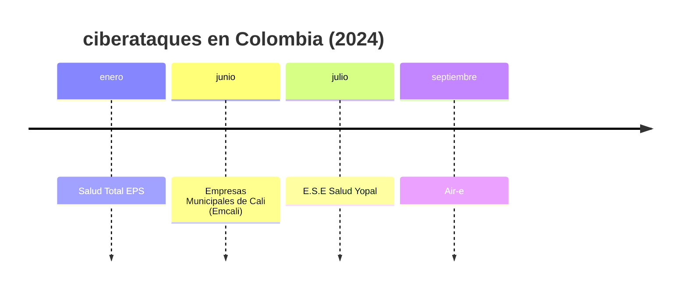

# 2024 Cyber attacks

- enero: Salud Total EPS.

	El 27 de enero de 2024, la plataforma tecnológica de Salud Total EPS, que cuenta con más de $4.6$ millones de afiliados, fue objeto de un ataque informático externo. Este incidente afectó la prestación de servicios a los usuarios, quienes enfrentaron dificultades para acceder a sus citas y otros servicios de salud. La entidad implementó planes de contingencia para mitigar el impacto y la Superintendencia Nacional de Salud inició un seguimiento para resolver las dudas y reclamaciones de los usuarios afectados.

	> <https://www.eltiempo.com/salud/abece-lo-que-deben-saber-los-usuarios-de-la-eps-total-tras-ataque-cibernetico-849784>.

- junio: Empresas Municipales de Cali (Emcali).

	En junio de 2024, las Empresas Municipales de Cali (Emcali) fueron blanco de un ataque cibernético que afectó sus sistemas de información. El incidente ocurrió el 9 de junio alrededor de las 9:30 a.m., comprometiendo plataformas comerciales, de facturación y de información de la empresa.

	> <https://www.csidb.net/csidb/incidents/cf5342db-ec0a-469b-b7ba-9452de8607ff/>.

- julio: E.S.E Salud Yopal.

	En julio de 2024, la E.S.E Salud Yopal sufrió un ciberataque que comprometió sus sistemas informáticos. Este incidente afectó la operatividad de la entidad, generando inconvenientes en la atención médica y en la gestión administrativa. Se implementaron medidas de contingencia para restaurar los servicios y proteger la información de los pacientes.

	> <https://www.csidb.net/csidb/incidents/77f9cd83-c595-400b-8c30-e38df92190df>.

- septiembre: Air-e.

	El 2 de septiembre de 2024, la empresa Air-e, principal proveedora de energía en el Caribe colombiano, sufrió un ciberataque de tipo ransomware que comprometió varios de sus sistemas informáticos. Este ataque afectó la facturación y el recaudo, impidiendo que los usuarios pudieran pagar sus recibos de energía de manera habitual. La empresa denunció el incidente ante la Fiscalía y trabajó en la recuperación de sus sistemas para restablecer el servicio y minimizar el impacto en sus $2.35$ millones de usuarios.

	> <https://www.eltiempo.com/colombia/barranquilla/ciberataque-a-air-e-compromete-sistemas-usuarios-afectados-no-pueden-pagar-recibos-3379773>.

	> <https://www.csidb.net/csidb/incidents/70476b5f-a24f-4023-92e4-b4cfd45296a5/>.

