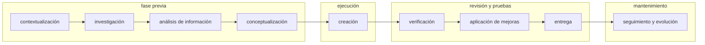

# Building digital narrative: tools and methodologies

## Metodología de UXC

## Modos de trabajo

Según el nivel de impacto, los tiempos y el alcance del proyecto, podemos trabajar de dos modos:

### Content First

Es una metodología que prioriza la creación de contenido antes de desarrollar la interfaz (UI), guiando tanto la estructura como el diseño.

> Primero definimos el mensaje y luego cómo se presenta.

#### Beneficios

- Claridad: contenido enfocado y relevante que comunica eficazmente.

- Usabilidad: diseño intuitivo que respalda y complementa el contenido.

- Eficiencia: evita rediseños costosos al tener bien definido el mensaje desde el inicio.

#### Retos

- Expertise: requiere que el equipo tenga un dominio teórico y práctico muy alto.

- Planificación: es esencial una cohesión y coordinación entre todas las áreas involucradas.

- Comunicación constante: se debe evitar la toma de decisiones aisladas que no respondan a las necesidades reales.

#### Fases

#### Fase $1$: exploración

Las acciones que se hacen en esta fase son:

- Leer la HU y la documentación relacionada.

- Aclarar dudas y solicitar datos adicionales al Product Owner (PO) de las líneas de negocio.

- Analizar funnels de conversión, métricas de canal, matrices de negocio y feedback de áreas de servicio.

#### Fase $2$: entendimiento

Las acciones que se hacen en esta fase son:

- Realizar talleres con los equipos para encontrar puntos de convergencia y alinear objetivos.

- Organizar y analizar la información recopilada, investigar a la competencia y profundizar en el perfil de los usuarios.

#### Fase $3$: storytelling y prototipo

Las acciones que se hacen en esta fase son:

- Definir el estilo de comunicación para cada paso del flujo, incluyendo tono y lenguaje.a

- Identificar momentos críticos y determinar el tono diferencial.

- Avanzar al prototipo de contenido una vez aprobado el estilo.

### Refinamiento

Es una metodología orientada a corregir lo que no funciona, adoptando un enfoque más reactivo. Se adapta a una interfaz o canal ya existente, con definiciones particulares preestablecidas.

#### Beneficios

- Reglas predefinidas: se cuenta con lineamientos claros sobre cómo y dónde estructurar el contenido.

- Ahorro de tiempo: la tarea está acotada y requiere menos procesos o fases en el diseño de contenido.

- Operatividad: puede ser ejecutada por roles junior, al tener procesos ya establecidos.

#### Retos

- Alcance limitado: si existen fallas en la experiencia, resulta difícil proponer o implementar mejoras sustanciales.

- Negociación: los equipos ya han cerrado definiciones, lo que complica llegar a nuevos acuerdos o cambios significativos.

## Design thinking

![[college/semesters/09/introduccion_a_la_gestion_de_proyectos_de_software/04-innovation_and_design_thinking#Design thinking|Design thinking]]
