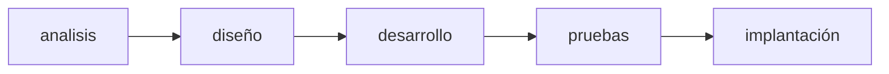
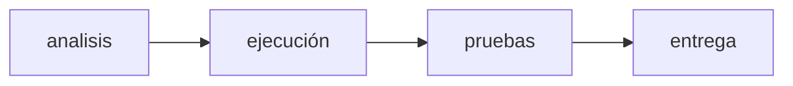
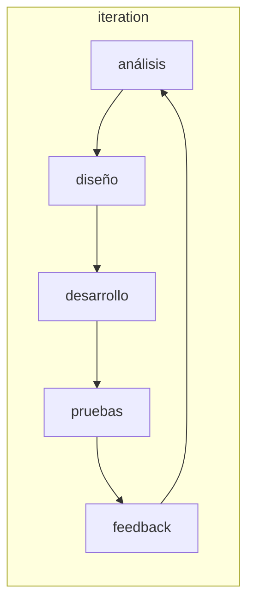

# Agile vs traditional frameworks

## Ciclos de vida de un proyecto

La diferencia entre el ciclo de vida de un proyecto y un producto es que para la primera se contemplan fases específicas y gestionadas, mientras que el segundo se enfoca en la operación y mantenimiento continuo.

|   enfoque   | requisitos | actividades                                                             | entrega                               | meta                                                                   |
|:-----------:|:----------:| ----------------------------------------------------------------------- | ------------------------------------- | ---------------------------------------------------------------------- |
| predictivo  |   fijos    | realizados una vez para todo el proyecto                                | entrega única                         | gestionar costos                                                       |
|  iterativo  | dinámicos  | repetidos hasta que el producto esté correcto                           | entrega única                         | perfeccionar/corregir la solución                                      |
| incremental | dinámicos  | realizados una vez por cada incremento                                  | entregas frecuentes y de menor tamaño | aumentar velocidad de entrega                                          |
|    ágil     | dinámicos  | repetidos hasta que esté correcto (combinación iterativa + incremental) | entregas frecuentes y pequeñas        | entregar valor continuo mediante retroalimentación y adaptación rápida |

## Predictivos

Aprovechan las cosas conocidas y probadas. Esta reducción en incertidumbre y complejidad permite a los equipos segmentar el trabajo en una secuencia de agrupaciones predecibles.

El plan dirige el trabajo. Por adelantado, se realiza tanta planificación como sea posible. Los requisitos son identificados con el mayor detalle posible. El equipo estima cuándo puede entregar qué entregables.

## Iterativos

Permiten obtener retroalimentación sobre trabajo parcialmente terminado o sin terminar, a fin de mejorarlo y modificarlo.

Se planifican prototipos y pruebas, pero las salidas pretenden modificar los planes creados al principio. Las revisiones tempranas ayudan a informar sobre el trabajo futuro del proyecto.

## Incrementales

Proporcionan entregables terminados que el cliente puede utilizar de inmediato.

Planean entregar subconjuntos sucesivos del proyecto en general. Los equipos pueden planificar varias entregas sucesivas de antemano o solo una a la vez. Las entregas informan sobre el futuro trabajo del proyecto

## Agiles

Aprovechan tanto los aspectos de las características iterativas como los de las incrementales. Iteran sobre el producto a fin de crear entregables terminados.

El equipo obtiene retroalimentación temprana y proporciona al cliente visibilidad, confianza y control sobre el producto.

El equipo también planifica y replanifica a medida que se obtiene más información a partir de la revisión de las entregas frecuentes.

## PMI (project management institute)

Cinco grupos de procesos, que constituyen etapas secuenciales y lógicas por las que pasa un proyecto:

1. Inicio: definir y autorizar formalmente el proyecto o una fase del mismo.

	- Identifica stakeholders.

	- Acta de constitución del proyecto.

	- Identifica riesgos iniciales.

	- Elección del director del proyecto.

2. Planificación: plan detallado del proyecto que guiará la ejecución y monitoreo y control del mismo.

	- Definición del alcance, cronograma, presupuesto y calidad.

	- Planificación de recursos humanos, comunicaciones, riesgos y adquisiciones.

3. Ejecución: coordinar y dirigir los recursos para implementar el plan del proyecto.

	- Coordinación y dirección de recursos.

	- Implementación del plan y aseguramiento de la calidad.

4. Monitoreo y control: medir el desempeño y progreso del proyecto para asegurar el cumplimiento de objetivos.

	- Seguimiento del desempeño y progreso.

	- Gestión de cambios, riesgos y control de costos.

5. Cierre: formalizar la aceptación del proyecto y cerrar actividades.

	Documentación de lecciones aprendidas y cierre administrativo.

> Aunque se presentan de forma secuencial, estos procesos pueden iterar según las necesidades del proyecto.

## Roles de equipo en el agilísimo

### Product Owner

Define qué se debe hacer y en qué orden. Actúa como la voz del cliente, asegurando que el trabajo pendiente sea claro y priorizado, por tal razón debe tener habilidades de negociación, abstracción, facilitación, influencia y comunicación.

### Scrum Master

Facilita la implementación del proceso Scrum y las prácticas ágiles. Elimina impedimentos y promueve la colaboración dentro del equipo. Actúa como coach, asegurando el cumplimiento de roles y ceremonias.

### Equipo de desarrollo

Participa en la estimación y planificación de sprints. Toma decisiones técnicas y se autoorganiza para cumplir objetivos. Colabora estrechamente con el Product Owner y el Scrum Master para entregar valor incremental.

## Diferencias entre roles

### Product Owner y Product Manager

El Product Manager se encarga de la estrategia global del producto, la definición de la visión a largo plazo y la identificación de oportunidades de mercado. Por su parte, el Product Owner aterriza esa visión en un backlog, priorizando las funcionalidades que se desarrollarán en cada iteración. Mientras el Product Manager trabaja con un horizonte de tiempo más amplio y coordina con áreas como marketing o ventas, el Product Owner se concentra en la colaboración diaria con el equipo de desarrollo y la entrega continua de valor.

### Product Owner y Business Analyst

El Business Analyst suele enfocarse en el análisis detallado de requerimientos, la documentación de procesos y la definición de soluciones técnicas y de negocio. El Product Owner, en cambio, asume la responsabilidad de priorizar el backlog, asegurando que el equipo trabaje en lo más valioso para el producto. Aunque ambos roles requieren habilidades de análisis y comunicación, el Product Owner actúa como la voz del cliente y toma decisiones finales sobre qué y cuándo se construye, mientras que el Business Analyst brinda soporte analítico y facilita la claridad en los requerimientos.