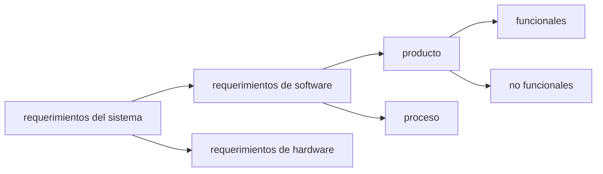
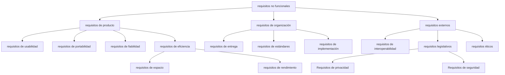

# Requirements engineering

## La verdad sobre los requisitos

### Citas

- "Nunca sopla viento favorable para el que no sabe a dónde va" Seneca ($55$ a.C. - $39$ d.C.).

- "El **coste** de un cambio en los requisitos una vez entregado el producto, es entre $60$ y $100$ veces superior al coste que hubiera representado el mismo cambio durante las faces iniciales de desarrollo" (Pressman, $2002$).

- "La correcta **obtención de los requisitos** es uno de los aspectos más críticos de un proyecto de software, independientemente del tipo de proyecto que se trate, dado que una mala captura de los mismos es la causa de la mayor parte de los problemas que surgen a lo largo del ciclo de vida" (Johnson, $1995$).

- "La parte más difícil de construir un sistema de software es decidir que construir,...Ninguna otra parte del trabajo afecta más negativamente al sistema final si se realiza de manera incorrecta. Ninguna otra parte es más difícil de rectificar después" (Brooks, $1995$).

## Fundamentos de requerimientos de software

El proceso de requerimientos de software cubre las fases de

- elicitación.

- análisis.

- especificación.

- validación.

durante todo el ciclo de vida.

"Los requerimientos de software expresan las **necesidades** y **restricciones** de un producto de software que contribuyen a la solución de algún problema del mundo real" (SWEBOK).

### Elicitación

#### Propósito (elicitación)

Investigar y documentar de manera exhaustiva las necesidades, expectativas y restricciones de los clientes y usuarios finales. Esto se logra mediante una comunicación directa y colaborativa, con el fin de identificar requisitos explícitos e implícitos que contribuyan a la solución del problema real. La fase busca establecer una base sólida para el proyecto, evitando malentendidos desde las etapas iniciales.

#### Técnicas (elicitación)

- Entrevistas.

- Reuniones grupales.

- Estudios in situ.

### Análisis

#### Propósito (análisis)

Examinar críticamente la información recopilada durante la elicitación para detectar conflictos, ambigüedades o inconsistencias. Además, busca organizar y priorizar las necesidades identificadas, transformándolas en requisitos estructurados y técnicamente viables. Esta fase asegura que los requisitos sean coherentes con los objetivos del proyecto y las capacidades del equipo.

#### Técnicas (análisis)

- Modelado conceptual (diagramas de flujo, casos de uso).

- Creación de prototipos de interfaz (mockups).

### Especificación

#### Propósito (especificación)

Documentar los requisitos de manera clara, precisa y estructurada, utilizando un lenguaje accesible para todos los stakeholders. Su propósito es crear una referencia unificada que guíe el diseño, desarrollo y validación del sistema, garantizando que no haya interpretaciones divergentes. Este documento sirve como contrato técnico entre las partes involucradas.

#### Técnicas (especificación)

- Redacción de documentos SRS (software requirements specification).

- Uso de plantillas estandarizadas (ISO/IEEE 29148).

- Tablas de requisitos funcionales y no funcionales.

### Validación

#### Propósito (validación)

Busca confirmar que los requisitos especificados reflejan fielmente las necesidades y expectativas de los usuarios y clientes. Su objetivo es asegurar que no existan discrepancias entre lo documentado y lo que realmente se requiere, mitigando riesgos de desviaciones en fases posteriores. Esta etapa valida la alineación del sistema propuesto con los objetivos del negocio.

#### Técnicas (validación)

- Revisiones formales con stakeholders.

- Pruebas de aceptación temprana (prototipos).

- Listas de chequeo para verificar completitud.

## Clasificación de requerimientos

## Tipos de requisitos

## Técnicas para educir requisitos

|     técnica      |    esfuerzo    |         aplicabilidad         |
|:----------------:|:--------------:|:-----------------------------:|
|   entrevistas.   |  medio-alto.   | requisitos nuevos/existentes. |
|    workshops.    | alto-muy alto. |     innovación y fuentes.     |
|   prototipos.    |   variable.    |     validación temprana.      |
| lluvia de ideas. |   muy bajo.    |     generación de ideas.      |