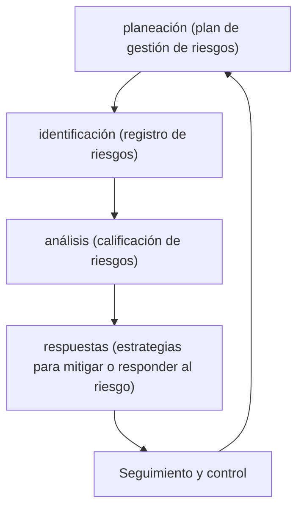

# Risk management

## Definición de riesgo

Se entiende como un **evento o condición incierta** que, de ocurrir, puede afectar de manera positiva o negativa los objetivos del proyecto. Según ISO 73:2009, es la combinación de la probabilidad de un evento y sus consecuencias.

## Características y consideraciones

- Cada proyecto de software es único, por lo que presenta incertidumbres, riesgos y oportunidades propias.

- El riesgo puede impactar el **alcance**, **tiempo**, **costo** y **calidad** del proyecto.

- Sus causas suelen encontrarse en los requerimientos, supuestos y restricciones.

- Los riesgos conocidos deben contar con un **plan de respuesta**, mientras que los no conocidos requieren un **plan de contingencia**.

## Taxonomía de riesgos

### SEI (software engineering institute)

Se agrupan en tres categorías

- Ingeniería de producto: se refiere a los riesgos inherentes al desarrollo y funcionamiento del software, tales como defectos, problemas de rendimiento, dificultades en la integración y desafíos en la calidad del producto.

- Entorno de desarrollo: engloba los riesgos asociados al ambiente en el que se desarrolla el software, incluyendo la disponibilidad y competencia de las herramientas, procesos y metodologías, así como la cultura organizacional que puede afectar la productividad y eficacia del equipo.

- Restricciones del programa: abarca los riesgos derivados de limitaciones externas o internas, como restricciones de tiempo, presupuesto y recursos, que pueden influir en la ejecución y el éxito general del proyecto.

### PMI

el PMI propone una estructura de desglose de riesgos (RBS) que clasifica los riesgos potenciales del proyecto en cuatro grandes categorías:

- Técnico: incluye riesgos relacionados con la definición y desarrollo del producto, como la ambigüedad en los requisitos, dificultades tecnológicas, interfaces complejas, problemas de rendimiento y fiabilidad, así como la calidad del software.

- Externo: se refiere a riesgos fuera del control directo del equipo del proyecto. Esto incluye retrasos o fallas de proveedores y subcontratistas, cambios normativos, fluctuaciones del mercado, necesidades del cliente y condiciones climáticas.

- De la organización: comprende riesgos internos que surgen de la estructura y funcionamiento de la organización, como dependencias entre proyectos, escasez de recursos, problemas de financiación o mala priorización de tareas.

- Dirección de proyectos: abarca los riesgos asociados a una gestión deficiente del proyecto, como estimaciones inadecuadas, planificación insuficiente, falta de control sobre el avance y mala comunicación entre los involucrados.

## Proceso de gestión de riesgo

## Respuesta al riesgo

### Negativo

- Evitar: cambiar el plan del proyecto para eliminar el riesgo, como alargar el cronograma.

- Transferir: trasladar el impacto negativo a un tercero, por ejemplo, mediante pólizas o garantías.

- Mitigar: reducir la probabilidad y/o impacto del riesgo, mediante capacitación, mejoras en procesos o tecnologías.

### Positivo

- Explotar: asegurar que la oportunidad se concrete eliminando la incertidumbre.

- Compartir: asignar a un tercero que esté mejor capacitado para aprovechar la oportunidad.

- Mejorar: maximizar la oportunidad aumentando su probabilidad o impacto positivo.
