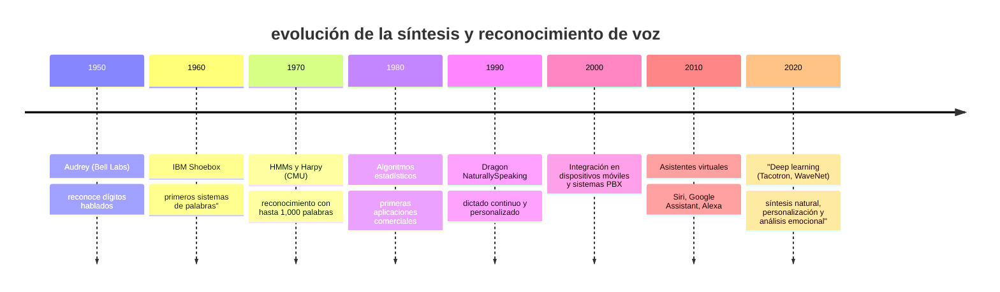

# Play HT

## Introducción

El reconocimiento y la generación de voz son fundamentales en la era digital porque permiten una interacción más natural y eficiente entre humanos y máquinas. En concreto:

- Accesibilidad y usabilidad: estas tecnologías facilitan el uso de dispositivos a personas con discapacidades, permitiendo dictar textos, controlar sistemas y acceder a la información sin necesidad de utilizar teclado o ratón.

- Productividad y eficiencia: al transformar el habla en texto, el reconocimiento de voz acelera tareas como la redacción de documentos y la transcripción de contenido, lo que puede aumentar significativamente la productividad.

- Interacción natural: la generación de voz (síntesis) permite a los sistemas emitir respuestas en un lenguaje hablado, haciendo que la comunicación sea más intuitiva y cercana. Esto es especialmente valioso en asistentes virtuales y aplicaciones de atención al cliente.

- Innovación e integración en múltiples sectores: estas tecnologías se están integrando en ámbitos como la educación, la salud y el marketing, abriendo nuevas oportunidades para automatizar procesos y personalizar experiencias, lo que además reduce costes operativos.

## Evolución de la síntesis y reconocimiento de voz

> Más información en este enlace <https://en.wikipedia.org/wiki/Timeline_of_speech_and_voice_recognition>.

- $1950$ Audrey (Bell Labs): reconocimiento de dígitos hablados.

	Audrey fue desarrollado en Bell Labs para reconocer dígitos hablados. Este proyecto pionero sentó las bases del reconocimiento automático del habla, aunque estaba limitado a un conjunto reducido de dígitos y a condiciones muy controladas.

- $1960$ IBM Shoebox: primeros sistemas de palabras.

	El IBM Shoebox fue uno de los primeros dispositivos capaces de reconocer un conjunto limitado de palabras. Demostró el potencial de la tecnología para aplicaciones prácticas, pero requería que el usuario hablara de forma muy clara y pausada.

- $1970$ HMMs y Harpy (CMU): reconocimiento con hasta 1,000 palabras.

	En esta década se introdujeron los modelos ocultos de Márkov (HMM) para modelar el habla. El sistema Harpy, desarrollado en CMU, alcanzó la capacidad de reconocer hasta 1,000 palabras, marcando un avance importante en la complejidad y capacidad del reconocimiento de voz.

- $1980$ algoritmos estadísticos: primeras aplicaciones comerciales.

	Durante los $80$ se aplicaron algoritmos estadísticos que mejoraron la precisión del reconocimiento de voz. Esto permitió las primeras aplicaciones comerciales, aunque la tecnología seguía funcionando de forma óptima sólo en entornos muy controlados.

- $1990$ Dragon NaturallySpeaking: dictado continuo y personalizado.

	Dragon NaturallySpeaking revolucionó el mercado al permitir el dictado continuo sin necesidad de pausas. Se adaptaba al habla individual mediante entrenamiento, aumentando la precisión y facilitando la redacción de textos largos de forma rápida y eficiente.

- $2000$ integración en dispositivos móviles y sistemas PBX.

	En los $2000$ se inició la integración del reconocimiento de voz en dispositivos móviles y sistemas de telefonía (PBX). Esto abrió la puerta a aplicaciones en atención al cliente y comunicación en tiempo real, permitiendo el control por voz en entornos dinámicos.

- $2010$ asistentes virtuales (Siri, Google Assistant, Alexa): interacción a manos libres.

	La popularización de asistentes virtuales como Siri, Google Assistant y Alexa convirtió al reconocimiento de voz en una herramienta de uso cotidiano. Estos sistemas permitieron una interacción a manos libres, mejorando la experiencia del usuario en entornos móviles y domésticos.

- $2020$ deep learning (Tacotron, WaveNet): síntesis natural, personalización y análisis emocional.

	La aplicación de técnicas de deep learning, como Tacotron y Wavenet, ha permitido generar voces sintetizadas con una calidad muy natural. Estas tecnologías facilitan la personalización de la interacción y permiten analizar el estado emocional del usuario, abriendo nuevas oportunidades en aplicaciones avanzadas.