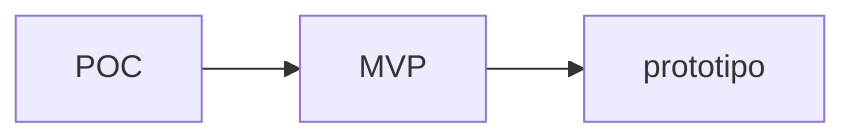

# Proof of concept and minimum viable model

## Prueba de concepto (POC)

La prueba de concepto es un proceso que valida la viabilidad técnica o comercial de una idea en sus etapas tempranas, con alcance limitado e inversión mínima. Su propósito principal es verificar si una idea de negocio puede convertirse en realidad antes de comprometer recursos significativos en su desarrollo.

La POC se enfoca en analizar atributos muy específicos del producto o negocio, buscando responder preguntas fundamentales como:

- ¿Utilizaría este producto o servicio?

- ¿En qué contexto lo usaría?

Su audiencia es principalmente interna (equipo emprendedor, inversionistas potenciales) y busca confirmar el potencial de la idea mediante una representación muy básica que no necesita ser funcional.

Esta etapa es crucial para identificar desafíos técnicos importantes y asegurar que el concepto central es factible antes de avanzar al siguiente nivel de desarrollo.

## Producto mínimo viable (MVP)

El producto mínimo viable es una versión del producto que incluye únicamente las funcionalidades esenciales por las cuales los clientes están dispuestos a pagar. A diferencia de la POC, el MVP debe ser totalmente funcional y está diseñado para ser lanzado al mercado con clientes reales.

Su objetivo principal es validar la venta y obtener retroalimentación temprana del mercado sobre si las características incluidas son suficientes para generar valor percibido y disposición de compra. El MVP representa el conjunto mínimo de atributos que justifican una transacción económica, permitiendo al emprendedor confirmar la demanda real antes de invertir en desarrollar funcionalidades adicionales. 

Esta fase es fundamental para aprender qué aspectos del producto resuenan con los clientes y cuáles necesitan ajustes o eliminación.

## Prototipo

El prototipo es una herramienta de validación que permite la interacción directa con clientes reales para obtener retroalimentación auténtica sobre la propuesta de valor. Los prototipos tangibilizan la oferta del emprendimiento, mostrando a los consumidores una representación del producto o servicio y cómo resuelve sus problemas o satisface sus necesidades.

Su propósito es: 

- validar supuestos específicos sobre el negocio.

- obtener aprendizajes tempranos antes de realizar inversiones significativas.

- confirmar si la propuesta de valor resuena con el mercado objetivo.

Un prototipo efectivo debe validar tanto la utilidad (¿resuelve un problema real en la vida del usuario?) como la forma (¿es clara, diferenciada, novedosa y atractiva?). Los prototipos pueden variar desde modelos físicos básicos hasta representaciones digitales interactivas, dependiendo de la naturaleza del producto o servicio que se está desarrollando.

### El alto riesgo después del prototipo

La etapa posterior a la creación del prototipo y antes del lanzamiento es de alto riesgo porque los emprendedores tienden a aferrarse a su primera interpretación de la retroalimentación y pueden tomar decisiones de alto costo basadas en suposiciones no totalmente validadas. Existe ambigüedad debido a las múltiples interpretaciones posibles de las reacciones de los consumidores.

Es crucial seguir validando las ideas con consumidores reales y diversas perspectivas para evitar errores costosos y no dejar de explorar mejores oportunidades. Solo la validación continua reduce el riesgo y aumenta las probabilidades de éxito.

### Aspectos clave para validar un prototipo

1. Definir el público objetivo: asegurarse de que el grupo de personas con quienes se valida el prototipo represente fielmente el segmento de clientes objetivo. La muestra debe reflejar las [[college/semesters/10/innovacion_y_emprendimiento_empresarial/classes/03-get_to_know_the_client#Características del consumidor|características]] del consumidor ideal para obtener retroalimentación relevante y aplicable.

2. Sitio y momento adecuados: verificar que el lugar y el momento de la validación coincidan con el entorno y las circunstancias reales del segmento esperado. Las condiciones de prueba deben simular el contexto natural en el que los clientes utilizarían el producto o servicio para obtener resultados auténticos.

3. Registrar la validación: utilizar imágenes, videos y otros medios para capturar las interacciones y reacciones de los usuarios durante el proceso de validación. Esta documentación permite un análisis posterior más detallado y la identificación de patrones de comportamiento que podrían no ser evidentes en el momento.

4. Actitud de entendimiento: el objetivo principal durante la validación es entender qué atributos del producto o servicio atraen al cliente y por qué, no realizar una venta agresiva. El emprendedor debe adoptar una postura de aprendizaje, escuchando activamente y observando sin prejuicios las reacciones genuinas de los usuarios.

## Relación entre POC, MVP y prototipo

El desarrollo de un producto tecnológico sigue una progresión lógica que utiliza POC, prototipos y MVP como herramientas complementarias en diferentes etapas del proceso. Esta secuencia permite validar una idea desde su viabilidad técnica inicial hasta su aceptación en el mercado, reduciendo riesgos y optimizando recursos en cada fase.

Esta progresión no es necesariamente lineal y puede involucrar iteraciones entre etapas. Por ejemplo, los aprendizajes obtenidos del prototipo pueden revelar necesidades de ajustes técnicos que requieran volver a una POC modificada. Lo crucial es que cada etapa tiene un propósito específico de validación que reduce la incertidumbre antes de comprometer mayores inversiones en la siguiente fase del desarrollo.

## Modelo de negocio

El modelo de negocio describe cómo una empresa crea, entrega y captura valor para sus clientes y para sí misma. En el contexto del desarrollo de productos tecnológicos, la validación del modelo de negocio es tan importante como la validación técnica del producto.

Existen tres áreas críticas de validación dentro del modelo de negocio:

- Validación de la propuesta de valor: confirmar que el producto o servicio realmente resuelve un problema significativo para los clientes y que estos perciben el valor ofrecido como suficiente para justificar su adopción.

- Validación del modelo de negocio: verificar que la manera en que se crea, entrega y captura valor es sostenible y escalable. Esto incluye validar canales de distribución, estructura de costos y fuentes de ingresos.

- Validación del segmento de clientes: asegurar que el grupo de personas identificadas como mercado objetivo realmente existe, tiene el problema que se busca resolver, y está dispuesto a pagar por la solución propuesta.

La propuesta de valor constituye el corazón del modelo de negocio, ya que define el beneficio único que diferencia la oferta en el mercado. Una propuesta de valor efectiva articula claramente qué problema se resuelve, para quién, y por qué la solución es superior a las alternativas existentes.
