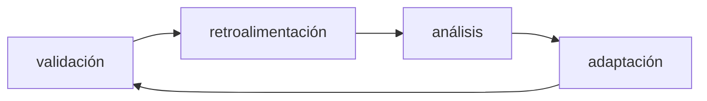

# Prototype evolution and evaluation

## Reflexión post-validación

Después de validar un prototipo, es fundamental realizar una reflexión crítica que responda dos preguntas esenciales que pueden haber cambiado a partir de la retroalimentación recibida. Primero, **¿quién es realmente tu cliente?** La validación puede revelar que el segmento de mercado inicialmente identificado no es el correcto o que existe un grupo de usuarios más relevante. Segundo, **¿qué necesidad estás resolviendo verdaderamente?** Los usuarios pueden indicar que el problema que pensabas resolver no es tan importante como otro que identificaron durante la interacción con el prototipo.

## Proceso de evolución del prototipo

1. Reidentificar al cliente: este paso puede revelar que el cliente ideal es diferente del inicialmente planteado.

2. Definir la nueva necesidad: esta redefinición debe basarse en evidencia concreta de las interacciones con usuarios reales, no en supuestos o intuiciones.

3. Lista de funcionalidades priorizadas: esta priorización debe enfocarse en las características que los usuarios consideran esenciales para resolver su problema, eliminando elementos que parecían importantes pero que la validación demostró como secundarios o innecesarios.

## Frase guía del prototipo

La frase guía es una herramienta metodológica que actúa como brújula durante el diseño y desarrollo del prototipo mejorado. Esta frase sintetiza la propuesta de valor en términos concretos y medibles, forzando al emprendedor a enfocarse en lo esencial.

La estructura de la frase guía es: "Mis clientes están dispuestos a pagarme si puedo resolver _necesidad específica_ a partir de una solución que SOLAMENTE haga _funcionalidades_".

El uso de "SOLAMENTE" es intencional y crítico, ya que obliga a priorizar despiadadamente y resistir la tentación de agregar funcionalidades innecesarias. Esta frase debe revisarse constantemente durante el desarrollo para asegurar que cada decisión de diseño e implementación está alineada con las funcionalidades mínimas que justifican el pago del cliente.

## Principios de diseño del prototipo

El prototipo debe adherirse a tres principios fundamentales que equilibran calidad con velocidad de desarrollo.

- Sencillez.

- Funcionalidad: el prototipo debe resolver efectivamente la necesidad central identificada. No es necesario que sea perfecto o que incluya todas las características deseables, pero sí debe demostrar de manera convincente que puede resolver el problema específico del cliente.

- Enfoque en lo funcional, no en lo perfecto: es preferible lanzar un prototipo funcional pero imperfecto que permita obtener retroalimentación temprana, antes que invertir tiempo en perfeccionar aspectos que podrían cambiar radicalmente después de la siguiente validación.

## El ciclo de iteración

El desarrollo de un prototipo exitoso no es lineal, sino que sigue un ciclo continuo de cuatro etapas que se repiten hasta alcanzar un producto que satisfaga las necesidades del mercado.

Este ciclo se repite múltiples veces, y cada iteración acerca el producto a la solución óptima para el mercado objetivo.

## Evaluación de prototipos

### Criterios de evaluación

Para evaluar objetivamente un prototipo, es necesario examinarlo bajo siete dimensiones críticas:

- Funcionalidad.

- Usabilidad.

- Viabilidad técnica.

- Viabilidad económica.

- Aceptación del usuario.

- Estética y diseño.

- Escalabilidad.

### Métodos de evaluación

Existen cinco métodos principales para evaluar prototipos, cada uno con ventajas específicas:

- Pruebas con usuarios: observar directamente a usuarios reales interactuando con el prototipo en escenarios auténticos. Este método proporciona evidencia conductual invaluable sobre usabilidad y funcionalidad.

- Entrevistas y encuestas: recopilar opiniones estructuradas de usuarios potenciales mediante preguntas específicas sobre aspectos del prototipo. Las entrevistas profundas revelan motivaciones y percepciones que no son evidentes en la observación.

- Matrices de evaluación: crear tablas que califican el prototipo en múltiples criterios, permitiendo comparaciones objetivas entre versiones o contra competidores. Esta herramienta es útil para decisiones de priorización.

- Focus group: discusiones grupales donde varios usuarios potenciales interactúan con el prototipo y comparten perspectivas. La dinámica grupal puede revelar insights que no emergen en entrevistas individuales.

- Simulación de uso: recrear escenarios de uso realistas y probar el prototipo bajo condiciones que imitan el entorno real de operación. Esto identifica problemas técnicos y de experiencia que solo aparecen en uso prolongado.

## Metodología para crear POC usando IA

Teniendo la idea inicial de una aplicación, se pueden realizar los siguientes pasos parar crear un POC usando IA.

1. Investigar tendencias: esta investigación debe incluir tanto aspectos técnicos como de mercado.

2. Identificar frustraciones: examinar reseñas sobre las aplicaciones existentes.

3. Sintetizar insights: relacionando la información recolectada de los dos puntos anteriores.

4. Diseñar prototipo funcional usando IA.
