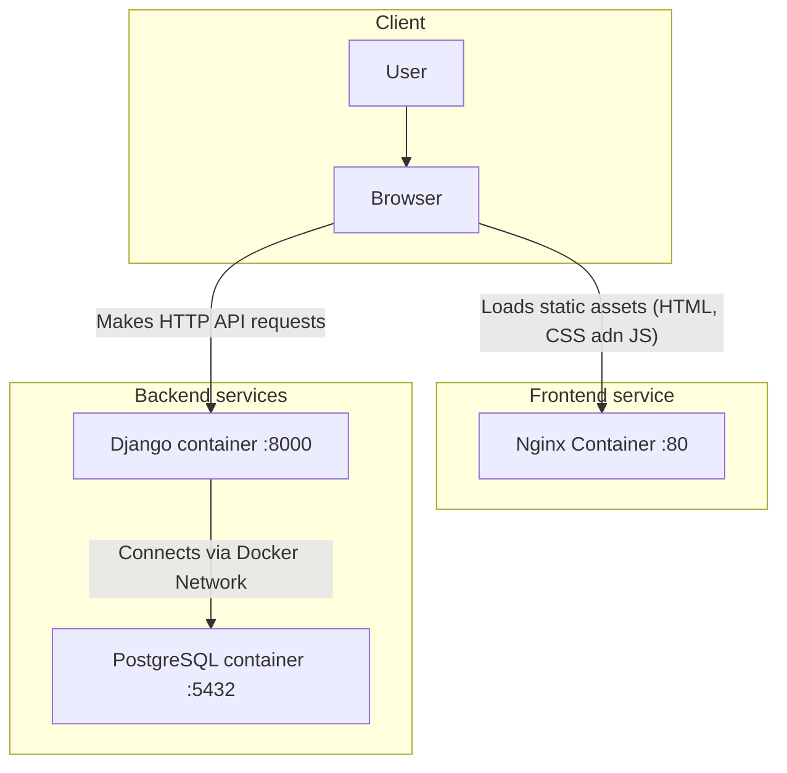

# Application architecture

## Client

- User: the person interacting with the application.

- Browser: The software on the user's computer (like Chrome or Firefox) that accesses the application.

## Frontend service

- Nginx container: this container holds the static, built files from your React + Vite project. It runs a lightweight Nginx web server to efficiently send these files (HTML, CSS, JavaScript) to the user's browser when they visit your site. It listens on port $80$, the standard port for web traffic.

## Backend services

- Django container: this is the core of the application's logic. It runs your Python/Django code, exposes an API, and processes business logic. It listens on port $8000$ for API requests from the browser.

- PostgreSQL container: this container runs the PostgreSQL database server. It is responsible for storing and retrieving all the application's data. It listens on port $5432$.

## Communication flow

1. The user's Browser first requests the main page from the Nginx container.

2. The Nginx container serves the static HTML, CSS, and JavaScript files, which load in the browser.

3. As the user interacts with the application, the JavaScript running in the Browser makes API calls to the Django Container to fetch or save data.

4. The Django Container processes these requests, communicating with the PostgreSQL Container over the internal Docker network to perform database operations.
