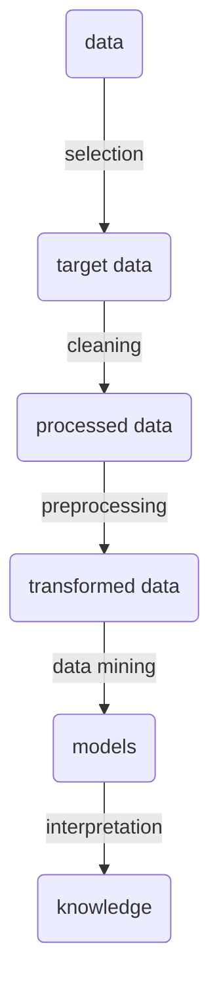

# Definition

It is a subfield of Artificial Intelligence (AI) that enables machines to **learn** and **make decisions** based on **data**, without the need to be explicitly programmed for each task. This discipline, through algorithms, gives computers the ability to identify patterns in massive data and make predictions.

> Potentially useful and non-obvious patterns.

