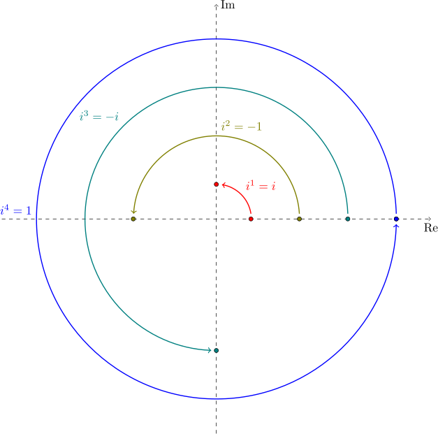

# Geometrical interpretation

We usually represent a complex number $a + b i$ by a point $(a,b)$ in the **complex plane**.

In this representation, multiplication by $i$ corresponds to a counterclockwise rotation of $90$ degrees about the origin, which is a quarter of a circle. Multiplication by $−i$ corresponds to a clockwise rotation of $90$ degrees about the origin.

