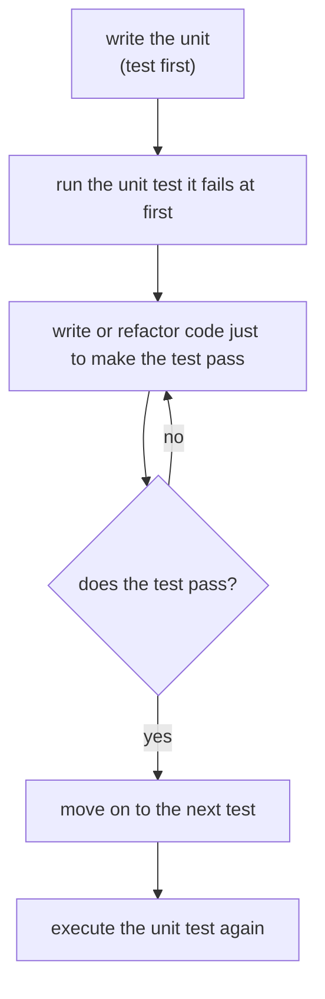

# Loop

```mermaid
flowchart TD
	a["write the unit <br/> (test first)"] --> b[run the unit test it fails at first]
	b --> c[write or refactor code just to make the test pass]
	c --> d{does the test pass?}
	d -- yes --> e[move on to the next test]
	d -- no --> c
	e --> f[execute the unit test again]
```
